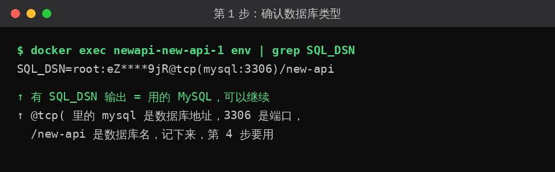
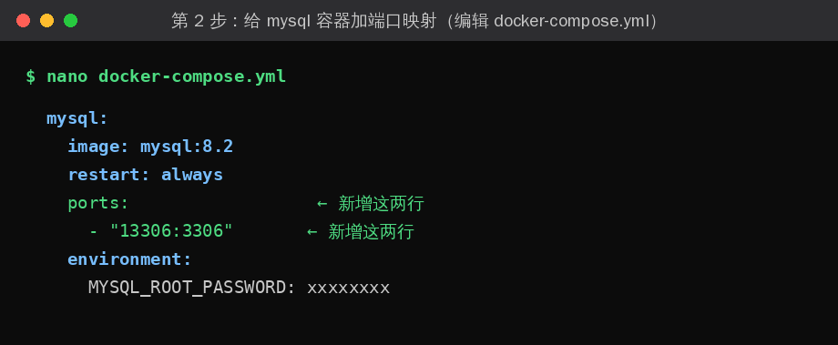
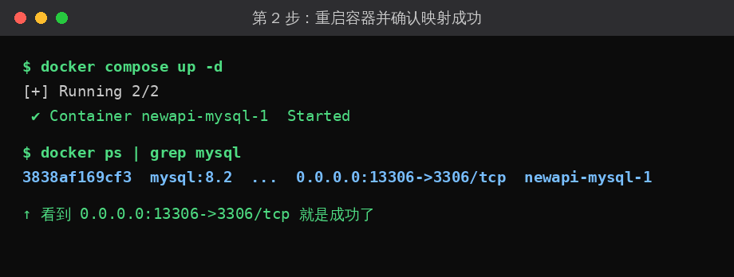
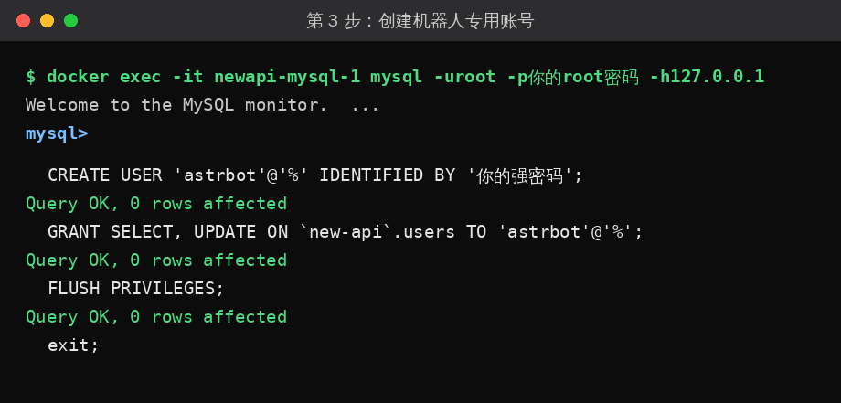
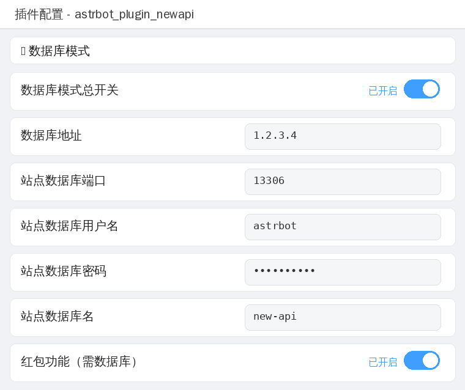
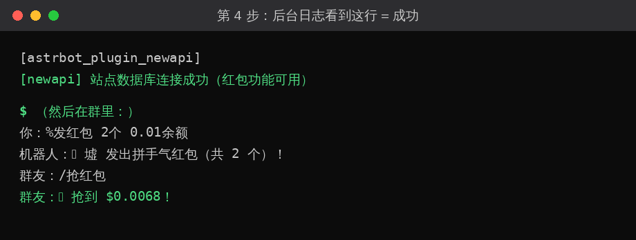

<p align="center">
  
</p>

<h1 align="center">astrbot_plugin_newapi_helper</h1>

AstrBot 插件：在 QQ 群里玩转你的 NewAPI 站点——**账号绑定 / 自助注册 / 每日签到 / 余额查询 / 拼手气红包 / 退群自动处理**。

支持两种工作模式：
- **数据库模式（推荐）**：直连站点 MySQL，无 429 限流，红包/签到/注册全都能做
- **API 模式（回退）**：用管理员令牌调站点接口，功能稍受限

---

## 功能一览

| 命令 | 权限 | 说明 |
| --- | --- | --- |
| `/注册` | 用户 | 群内自助注册：QQ 号当账号，随机 8 位密码**临时会话私聊发送**（机器人管理员可直接私聊群友，无需加好友）；重名自动找回重置密码；可设 QQ 等级 + 群聊等级双重门槛 |
| `/找回密码`（`/我的密码`） | 用户 | 私聊查询自己的账号密码（仅私聊可用） |
| `/绑定 <ID>` | 用户 | 绑定指定 NewAPI 用户：机器人群里提示后，绑定者私聊发「账号 密码」验证绑定并自动换分组 |
| `/密码绑定 <用户名> <密码>` | 用户 | 传统方式绑定（默认仅私聊可用） |
| 私聊发「账号 密码」 | 用户 | 直接私聊机器人发「账号 密码」（无需命令前缀）即可绑定 |
| `/解绑` | 用户 | 解除自己的绑定 |
| `/签到`（`/打卡`） | 用户 | 每日签到领额度；站内签过会提示"今日已签到" |
| `/余额`（`/查询余额`） | 用户 | 剩余额度 / 累计消耗 / 调用次数 |
| `/发红包 <个数> <总金额>` | 用户 | 拼手气红包：总额从发起者余额**真实扣除**，随机拆分，不显示各包金额 |
| `/抢红包` | 用户 | 抢本群红包，随机金额**真实入账**后才提示抢到多少 |
| `/抢劫 @某人` | 用户 | 抢劫群友余额：成功抢走、失败赔偿，均真实扣款/入账（需开启「抢劫玩法」） |
| `/排行榜`（`/排行`）`[llm\|调用\|消耗]` | 用户 | 使用排行榜：LLM 模型热度 / 调用次数 / 额度消耗，渲染成图片（需数据库模式） |
| `/帮助` | 用户 | 命令列表 |
| `/查用户 <关键词>` | 管理员 | 搜索站点用户及绑定状态（支持用户名 / 数字ID / 已绑定QQ号 / @某人） |
| `/强制解绑 <QQ号>` | 管理员 | 强制解除某 QQ 的绑定 |
| 退群事件 | 自动 | 自动解绑，可配置同时删除站点账号 |

> 💡 支持自定义指令前缀：配置 `%`、`*` 后，`%签到`、`%注册` 同样生效，且不会触发 LLM 回复。

---

## 快速开始（3 分钟）

1. AstrBot 管理面板 → 插件 → 从仓库 URL 安装：`https://github.com/Shawlei/astrbot_plugin_newapi_helper`
2. 插件配置页填两项：
   - `base_url`：NewAPI 站点地址
   - `admin_token`：管理员的**系统访问令牌**（浏览器打开你的 NewAPI 网站 → 登录管理员账号 → 右上角头像 → 个人设置 → 找到「系统访问令牌」→ 生成，复制过来）
3. 保存 → 重载插件（管理面板 → 插件 → 本插件 → 重载）→ 私聊机器人发「账号 密码」或 `/密码绑定 用户名 密码` 测试绑定

到这里，绑定/注册/签到/余额都能用了（API 模式）。
**想开红包或彻底告别 429？往下看数据库教程。**

---

## 🗄️ 数据库教程

> **为什么需要数据库？**
> 新版 new-api 的接口**不支持修改用户额度**（官方源码确认），所以红包的真实扣款/入账必须直连数据库。
> 开启数据库模式后，余额/签到/绑定验证/注册/分组变更全部走数据库，又快又稳，还没有 429。
> 数据库信息直接填在**插件配置页的「🗄️ 数据库模式」分组**里，不需要创建 .env 文件。

### 第 1 步：确认你的数据库类型

先在 NewAPI 服务器上执行 `docker ps`，看看 new-api 是不是容器在跑：

- **能看到 new-api（还有 mysql）的容器** → 你是容器/面板部署。执行下面命令看数据库类型（`<new-api容器名>` 换成你刚看到的名字）：

```bash
docker exec <new-api容器名> env | grep SQL_DSN
```

  - 输出类似 `root:密码@tcp(mysql:3306)/new-api` → 是 **MySQL**，✅ 继续往下
  - 没有输出 → 是 **SQLite**，❌ 不支持本教程（数据库模式和红包不可用，其余功能正常）

- **没有 new-api 容器**（直接跑在服务器上）→ 你是裸机部署，用你装数据库时自己设置的账号密码就行，直接跳到第 2 步



### 第 2 步：让机器人连上你的 MySQL（按部署方式三选一）

先记下三个信息，第 3 步要用：**MySQL 地址、端口、root 密码**（SQL_DSN 里都有）。

<details>
<summary><b>🐚 点我展开：裸机部署（new-api 直接跑在服务器上）</b></summary>

<br>

1. 确认 MySQL 在本机运行，记下端口（默认 `3306`）
2. 确认 MySQL 允许远程连接：
   - 编辑 MySQL 配置（`/etc/mysql/my.cnf` 或 `/etc/my.cnf`），确认 `bind-address = 0.0.0.0`
   - 重启 MySQL：`systemctl restart mysql`
3. 放行防火墙：`ufw allow 3306` 或宝塔/1Panel 防火墙里放行 `3306`，云服务器还要在**控制台安全组**放行
4. 第 3 步的「MySQL 地址」填这台服务器的公网 IP

</details>

<details>
<summary><b>🐳 点我展开：容器部署（docker-compose 跑 new-api + mysql）</b></summary>

<br>

1. 编辑 `docker-compose.yml`，给 `mysql` 服务加端口映射（缩进和 `environment:` 对齐）：

   ```yaml
     mysql:
       image: mysql:8.2
       ports:
         - "13306:3306"    # 宿主机13306 → 容器3306
   ```

2. 重启并确认：

   ```bash
   docker compose up -d
   docker ps | grep mysql   # 看到 0.0.0.0:13306->3306/tcp 即成功
   ```

3. 放行防火墙：`13306`（宝塔/1Panel 防火墙 + 云控制台安全组）
4. 第 3 步的「MySQL 地址」填这台服务器的公网 IP，「端口」填 `13306`

> 💡 端口 `13306` 只是示例，随便选个没被占用的端口都行。





</details>

<details>
<summary><b>🪟 点我展开：面板部署（宝塔 / 1Panel 应用商店安装）</b></summary>

<br>

**宝塔面板：**

1. 宝塔 → **Docker → 容器** → 找到 new-api 用的 mysql 容器 → 编辑 → 添加端口映射 `13306 → 3306`（面板不支持改的话，用上面容器部署的命令行方式）
2. 宝塔 → **安全** → 放行 `13306`
3. 第 3 步的「MySQL 地址」填这台服务器的公网 IP，「端口」填 `13306`

**1Panel 面板：**

1. 1Panel → **容器** → 找到 mysql 容器 → 编辑端口映射，添加 `13306 → 3306`
2. 1Panel → **主机 → 防火墙** → 放行 `13306`
3. 同上填写

> 如果 SQL_DSN 里是 `127.0.0.1:3306`，说明 new-api 用的是面板自带的 MySQL：直接在面板「数据库」里找到对应库，把权限改为「指定 IP = 机器人IP」，端口用 `3306` 即可，无需端口映射。

</details>

> ⚠️ **端口被占用怎么办？** 启动时如果报 `port is already in use`，说明这个端口被别的程序占了，换一个端口数字（比如 `13307:3306`）再 `docker compose up -d` 即可。用 `ss -tlnp | grep 端口号` 可以查谁在占用。

### 第 3 步：创建机器人专用账号（三种部署方式通用）

登录 MySQL（容器部署用 `docker exec -it <mysql容器名> mysql -uroot -p密码` 进入）：

```sql
CREATE USER 'astrbot'@'%' IDENTIFIED BY '你的强密码';
GRANT SELECT, UPDATE ON `new-api`.users TO 'astrbot'@'%';
FLUSH PRIVILEGES;
exit;
```



> 只给了 `users` 单表的读写权限，安全；熟练后可把 `'astrbot'@'%'` 的 `%` 换成机器人的 IP，更安全。

### 第 4 步：插件配置页开启数据库模式

1. 打开「🗄️ **数据库模式总开关**」→ 下面的「数据库设置」自动展开
2. 填入：地址、端口、用户名 `astrbot`、密码、数据库名
3. 需要红包就打开「红包功能」
4. 保存 → **重载插件**



> 图中 `1.2.3.4` 为示例，请填你自己的服务器 IP。

看到后台日志 `[newapi] 站点数据库连接成功（红包功能可用）` 即成功 🎉



### 常见报错速查

| 报错 | 解决 |
| --- | --- |
| `port is already in use` | 端口被占用，换个端口数字重试 |
| `ERROR 1045: Access denied` | 密码错，或库里存在多个同名账号（`SELECT user,host FROM mysql.user WHERE user='astrbot';` 检查，多余的用 `ALTER USER` 改成同密码） |
| `ERROR 2002: ... socket` | MySQL 还没启动完，等 30 秒；登录命令加 `-h127.0.0.1` |
| 插件报"站点数据库连接失败" | 防火墙没放行，或地址/端口/账号填错 |
| 抢红包提示"账号已在站点被删除" | 该用户在后台被删了，插件已自动解绑，重新 `/注册` 或 `/绑定 <ID>` |

---

## 配置项详解

### 基础

| 配置项 | 默认值 | 说明 |
| --- | --- | --- |
| `base_url` | - | NewAPI 站点地址 |
| `admin_token` | - | 管理员系统访问令牌（API 模式用） |
| `admin_user_id` | `1` | 管理员数字 ID |
| `quota_per_unit` | `500000` | 多少 quota = 1 美元 |
| `show_cny` | `true` | 余额显示人民币换算（≈ ¥xx） |
| `exchange_rate` | `7.2` | 汇率（仅展示） |

### 绑定与注册

| 配置项 | 默认值 | 说明 |
| --- | --- | --- |
| `bind_verify_password` | `true` | 密码绑定是否验证账号密码 |
| `allow_group_bind` | `false` | 允许群聊中密码绑定 |
| `private_direct_bind` | `true` | 私聊直接发「账号 密码」（无需命令前缀）即绑定 |
| `private_temp_session` | `true` | 主动私聊走「临时会话」直接发群友（无需加好友，需机器人为群管理员/群主） |
| `bind_protect_admin` | `true` | 禁止 ID 绑定管理员账号 |
| `bind_group` | 空 | `/绑定 <ID>` 成功后自动更换的分组 |
| `register_enabled` | `true` | 开启群内自助注册 |
| `register_min_level` | `0` | 最低 QQ 群聊等级（0=不限） |
| `register_min_qq_level` | `0` | 最低 QQ 账号等级（双重校验） |
| `register_group` | `default` | 注册默认分组 |

### 签到

| 配置项 | 默认值 | 说明 |
| --- | --- | --- |
| `checkin_enabled` | `true` | 签到开关 |
| `checkin_cooldown_hours` | `24` | 签到冷却时长 |
| `checkin_min_usd` / `checkin_max_usd` | `0.1` / `0.5` | 数据库模式签到随机额度（美元） |

### 排行榜

| 配置项 | 默认值 | 说明 |
| --- | --- | --- |
| `rank_enabled` | `true` | 使用排行榜开关 |
| `rank_top_n` | `10` | 每个榜单显示前 N 名 |

> 排行榜依赖数据库模式：直接查站点 `logs` / `users` 表，用 AstrBot 的 HTML 文转图能力渲染成图片（`self.html_render` → Chromium）。若 AstrBot 未配置 t2i 服务，会自动降级为纯文本排行榜。

### 🗄️ 数据库模式

| 配置项 | 默认值 | 说明 |
| --- | --- | --- |
| `db_enabled` | `false` | 总开关，开启后展开下方设置 |
| `db.host` / `db.port` / `db.user` / `db.pass` / `db.name` | - | 站点 MySQL 连接信息 |
| `db.hongbao_enabled` | `false` | 红包功能开关 |
| `db.hongbao_expire_hours` | `24` | 红包过期时间（过期自动退回发起者） |
| `db.rob_enabled` | `false` | 🔪 抢劫玩法开关（开启后展开下方「抢劫设置」） |
| `db.rob.success_rate` | `0.5` | 抢劫成功率（0~1） |
| `db.rob.amount_min` / `amount_max` | `1.0` / `10.0` | 单次抢到金额范围（美元，按 `quota_per_unit` 换算为额度扣除） |
| `db.rob.penalty` | `1.0` | 抢劫失败赔偿（美元，赔给被抢者） |
| `db.rob.cooldown_seconds` | `300` | 抢劫冷却时间（秒） |
| `db.rob.daily_limit` | `0` | 每人每天最多抢劫次数（0 = 不限） |
| `db.rob.protect_balance` | `0` | 目标余额保护线（美元，低于此值不可被抢） |

### 其他

| 配置项 | 默认值 | 说明 |
| --- | --- | --- |
| `debug_mode` | `false` | 调试模式：跳过冷却/已绑定检查，日志输出全部请求详情 |
| `custom_command_prefixes` | `[]` | 自定义指令前缀（如 `%`、`*`） |
| `whitelist_groups` | `[]` | 群聊白名单：仅这些群号内插件生效（留空=所有群生效，私聊不受限） |
| `admin_qqs` | `[]` | 管理员 QQ 号列表：可使用 `/查用户`、`/强制解绑` 等管理员命令（无需另配 AstrBot 管理员） |
| `watch_groups` | `[]` | 监听退群的群号列表（留空=所有群） |
| `delete_on_leave` | `false` | 退群后删除站点账号（软删除） |

---

## 工作原理

- **数据库模式（推荐）**：直连站点 MySQL（aiomysql）
  - 余额：`SELECT users`
  - 签到：判重 `checkins` 表 → `UPDATE users.quota` → 插入签到记录（站点日历可见）
  - 绑定验证 / 注册：自动探测站点密码哈希算法（bcrypt / argon2 / sha256 / md5），直接校验与生成
  - 分组变更 / 退群删号（软删除 users + tokens）/ 用户搜索：纯 SQL
  - 红包：发起时原子扣款（余额不足自动失败），抢到直接入账，过期自动退回
  - 抢劫：成功时目标原子扣款 + 抢劫者入账，失败时抢劫者扣赔偿 + 目标入账（失败入账自动回滚），带冷却与余额保护线
- **API 模式（回退）**：管理员令牌调 Admin API
  - 注册建号、密码验证、余额、官方签到接口（需站点开启「签到设置」）
  - ⚠️ 新版 new-api 的 `PUT /api/user/` 不支持修改额度，API 模式无红包

## 注意事项

1. `admin_token` 是超管权限，勿泄露；数据库密码同理
2. `delete_on_leave` 删除不可逆，谨慎开启
3. ID 绑定需私聊验证账号密码，防止知道 ID 就能乱绑定；`bind_protect_admin` 保护管理员账号
4. QQ 等级门槛依赖 OneBot 适配端（NapCat / Lagrange）返回 `level` 字段
5. 在站点后台删除已绑定的用户后，插件会在其下次操作时自动解绑并提示

## License

MIT
